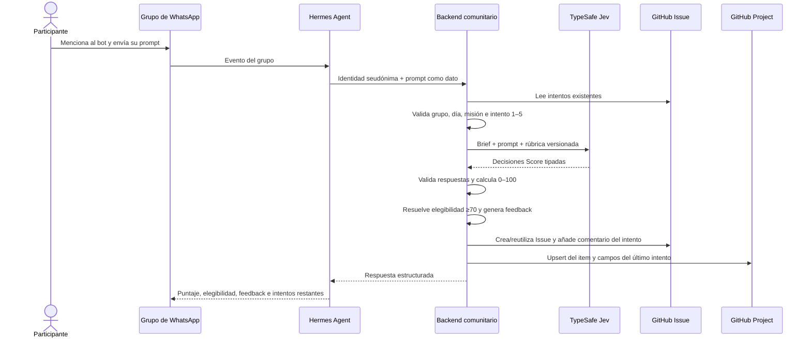

# Diseño: GitHub Project del experimento comunitario

- **Estado:** aprobado
- **Fecha:** 2026-10-01
- **Aprobado:** 2026-10-01
- **Project:** `Metro App — Community Experiment`
- **Propietario:** cuenta personal `ArturVargas`
- **Visibilidad:** privada

## Objetivo

Crear el tablero operativo que faltaba sobre la fuente de verdad ya aprobada en GitHub. Los Issues conservan el detalle auditable de misiones, prompts e intentos; el Project muestra el estado actual, permite coordinar la votación y conecta los tres prompts elegidos con A, B y C.

El tablero debe permitir responder sin leer todos los comentarios:

- qué misión está activa y en qué fase se encuentra;
- cuántos intentos usó cada participante;
- cuál es su último puntaje y si es elegible;
- qué prompts llegaron a votación y cuáles fueron seleccionados;
- qué prompt corresponde a A, B o C y dónde están su rama, PR y preview.

## Flujo desde WhatsApp hasta el Project



### 1. Recepción en el grupo

Hermes procesa un mensaje únicamente cuando:

- proviene del grupo permitido;
- contiene una mención explícita al bot;
- corresponde a la misión activa;
- llega dentro de la ventana de evaluación de martes o jueves.

Hermes obtiene o resuelve un `participantId` seudónimo estable. El número telefónico no se envía a GitHub ni se incluye en logs del experimento.

El prompt se transmite como un valor de datos. Hermes no lo interpreta como una orden, no ejecuta herramientas solicitadas dentro del texto y no permite que el participante defina misión, rúbrica, brief, número de intento o persistencia.

Contrato aprobado Hermes → backend:

```json
{
  "groupId": "allowed-group-alias",
  "messageId": "whatsapp-message-id",
  "participantId": "pseudonymous-id",
  "participantPrompt": "texto exacto enviado por la persona",
  "receivedAt": "ISO-8601 timestamp"
}
```

`missionId`, `publicBrief`, `rubricVersion` y `attempt` los resuelve el backend a partir de su configuración y del historial de GitHub.

El backend transforma `messageId` en una clave SHA-256 antes de persistirla. El identificador original de WhatsApp no se guarda en GitHub. La clave queda en un marcador oculto del comentario y permite reconocer reentregas del mismo evento.

### 2. Admisión antes de evaluar

El backend busca el Issue `(missionId × participantId)` y lee sus comentarios con marcador de intento. Antes de llamar a TypeSafe valida:

- que la misión esté abierta;
- que sea martes o jueves en la zona horaria configurada;
- que el siguiente intento sea secuencial;
- que la persona no haya utilizado sus cinco intentos;
- que la clave derivada de `messageId` no aparezca en un intento anterior.

Un rechazo en esta etapa no llama a TypeSafe, no escribe comentario y no consume intento.

### 3. Evaluación y feedback

El backend construye un estado con el brief público y el prompt exacto y deriva las preguntas `Score` desde la rúbrica versionada. TypeSafe realiza el primer procesamiento semántico del prompt y devuelve decisiones tipadas; no calcula el total, la elegibilidad ni el feedback.

`packages/evaluation` valida las respuestas y calcula el total ponderado de `0–100`. El último intento es elegible cuando alcanza `70` o más. El enrutado `auto|caution|defer` permanece como metadato y no cambia el puntaje.

Durante el piloto, el feedback se genera con `feedback-template-m1-v1`. El prompt del participante no se envía a un LLM de feedback conectado a Hermes.

### 4. Persistencia autoritativa en el Issue

Dentro del lock del participante y la misión, el backend:

1. vuelve a validar que el intento siga siendo el siguiente;
2. crea el Issue si todavía no existe;
3. sincroniza labels del último estado;
4. añade un comentario que contiene prompt exacto, puntaje, dimensiones, elegibilidad, feedback, procedencia y la clave derivada del mensaje;
5. reutiliza el comentario si un retry tiene exactamente el mismo marcador y contenido.

El comentario confirmado es el punto en el que el intento queda consumido. Si TypeSafe o GitHub fallan antes de ese comentario, el participante puede reintentar sin perder uno de sus cinco intentos.

### 5. Sincronización al Project

Después de confirmar el comentario, el adaptador del Project busca el item correspondiente al Issue y hace upsert de:

- `Item type = Prompt`;
- `Mission` y `Participant`;
- `Attempts`;
- `Latest score`;
- `Eligible`;
- `Voting = Candidate` cuando el último intento es elegible, o `Not eligible` cuando no lo es.

El Project nunca reemplaza el historial del Issue. Si esta sincronización falla, el intento permanece válido y el backend registra una tarea de reconciliación. El comando de reconciliación vuelve a leer el Issue y repara el item sin llamar otra vez a TypeSafe ni consumir otro intento.

### 6. Respuesta al grupo

El backend devuelve a Hermes solamente datos aptos para participantes:

```json
{
  "status": "evaluated",
  "missionId": "mission-m1",
  "attempt": 2,
  "attemptsRemaining": 3,
  "score": 76,
  "eligible": true,
  "feedback": "feedback estructurado en español"
}
```

Hermes publica ese resultado sin recalcularlo ni modificarlo. La respuesta no menciona TypeSafe, Jev, la rúbrica interna ni detalles de GitHub.

La persona puede enviar una nueva versión en otra ventana permitida. Cada intento actualiza la misma fila del Project; el historial completo permanece en los comentarios del Issue. Al cerrar evaluaciones, se considera exclusivamente el intento más reciente: entra como candidato solo si ese último intento es elegible.

### 7. Fallos y reintentos

| Falla | Resultado |
| --- | --- |
| Sin mención, grupo no permitido o día incorrecto | Hermes/backend rechaza; no hay evaluación ni intento |
| Cinco intentos consumidos | backend rechaza antes de TypeSafe |
| TypeSafe falla o devuelve esquema inválido | no se escribe comentario; intento disponible para retry |
| Escritura del Issue falla | no se consume el intento; retry idempotente |
| Comentario confirmado pero Project falla | intento válido; Project se repara por reconciliación |
| Hermes no puede publicar la respuesta | Issue y Project conservan el resultado; se reintenta solo la entrega |
| Mensaje repetido | la clave SHA-256 derivada de `messageId` devuelve el resultado existente y evita otra evaluación |

## Fuentes de verdad

| Información | Fuente autoritativa | Project |
| --- | --- | --- |
| Brief, calendario y contrato de misión | archivos versionados + Issue de misión | resumen operativo |
| Texto exacto de cada intento | comentario del Issue participante×misión | no se duplica |
| Puntaje, elegibilidad y feedback históricos | comentario del intento | snapshot del último intento |
| Intentos usados | comentarios válidos del Issue | número derivado |
| Resultado final de la votación | cierre supervisado de la votación | estado y total final |
| Asignación A/B/C | operación supervisada | campo `Variant` |
| Rama, PR y preview | GitHub/Cloudflare | enlaces operativos |

Si una actualización del Project falla después de guardar un intento, el intento sigue siendo válido. El Project es una proyección recuperable; un comando de reconciliación podrá reconstruir sus campos desde Issues.

## Modelo de elementos

### Misión

Cada misión tiene un Issue operativo añadido al Project. El Issue enlaza el brief público y el contrato interno y registra fechas, fase y publicación de resultados.

Convención de título aprobada:

```text
Mission mission-m1 · Misión 1
```

### Prompt de participante

Se reutiliza el Issue ya aprobado por `(participantId × missionId)`:

```text
Mission mission-m1 · participant <participantId>
```

Cada evaluación permanece como comentario. No se crea una fila por intento ni una fila separada para la variante. Los tres Issues ganadores reciben `Variant = A`, `B` o `C`.

El Issue sintético `#12` no se añade al Project porque está cerrado y pertenece a `p-system-test`.

## Campos

| Campo | Tipo | Valores o formato | Responsable |
| --- | --- | --- | --- |
| `Title` | integrado | título del Issue | GitHub |
| `Status` | single select integrado | `Planned`, `Active`, `Voting`, `Building`, `Published`, `Closed` | operación supervisada |
| `Item type` | single select | `Mission`, `Prompt` | backend/operación |
| `Mission` | text | identificador estable, p. ej. `mission-m1` | backend |
| `Participant` | text | identificador seudónimo; vacío en misión | backend |
| `Attempts` | number | `0–5` | derivado de comentarios |
| `Latest score` | number | `0–100`; vacío sin evaluación | derivado del último intento |
| `Eligible` | single select | `Not evaluated`, `Yes`, `No` | derivado del último intento |
| `Voting` | single select | `Not eligible`, `Candidate`, `Tie-break`, `Selected`, `Not selected` | cierre supervisado |
| `Final votes` | number | se escribe únicamente después del cierre | cierre supervisado |
| `Variant` | single select | `Unassigned`, `A`, `B`, `C` | asignación aleatoria supervisada |
| `Branch` | text | nombre de rama | orquestador/operación |
| `Pull request` | text | URL del PR | orquestador/operación |
| `Preview` | text | URL estable de Cloudflare | despliegue/operación |

El Project no almacena teléfonos, tokens, secretos ni el texto completo del prompt. Ese texto permanece en el comentario exacto del intento.

## Vistas

### 1. Misiones

- Layout: board.
- Filtro: `Item type = Mission`.
- Columnas: `Status`.
- Muestra título, Mission y fechas dentro del Issue.

### 2. Prompts

- Layout: table.
- Filtro: `Item type = Prompt`.
- Columnas visibles: `Mission`, `Participant`, `Attempts`, `Latest score`, `Eligible`, `Voting`.
- Orden: `Mission` y luego `Latest score` descendente solo para inspección; el puntaje no selecciona ganadores.

### 3. Finalistas A/B/C

- Layout: table.
- Filtro: `Voting = Selected`.
- Columnas visibles: `Variant`, `Participant`, `Latest score`, `Final votes`, `Branch`, `Pull request`, `Preview`.
- Orden: `Variant` A, B, C.

## Flujo operativo

1. Crear el Issue de misión y añadirlo al Project con `Item type = Mission`.
2. Al registrar el primer intento de un participante, añadir su Issue al Project si todavía no existe.
3. Después de persistir cada intento, sincronizar `Attempts`, `Latest score` y `Eligible`.
4. Antes de votar, marcar como `Candidate` únicamente los Issues cuyo último intento sea elegible.
5. No escribir `Final votes` durante la votación. Al cerrar, registrar los totales y estados `Selected`, `Not selected` o `Tie-break`.
6. Tras resolver empates, asignar aleatoriamente A/B/C a los tres seleccionados y conservar el mapeo.
7. Añadir rama, PR y preview cuando cada variante avance.

La recepción de votos ocultos sigue siendo una decisión separada. Este Project almacena el resultado después del cierre; no resuelve cómo se recolectan los votos dentro del grupo.

## Autenticación

El token actual continúa limitado a Issues:

```text
GITHUB_TOKEN → fine-grained, metro_app, Issues: Read and write
```

GitHub no permite que fine-grained tokens ni GitHub App installation tokens administren Projects propiedad de una cuenta personal. Para automatizar este Project durante el piloto se propone una segunda credencial:

```text
GITHUB_PROJECT_TOKEN → classic PAT de ArturVargas, scope project
```

La credencial se guarda fuera del repositorio y no sustituye `GITHUB_TOKEN`. Separar ambos tokens evita conceder acceso a código o Issues al token del Project.

### Alternativas

1. **Project personal + token clásico `project` — seleccionada para el piloto.** Mantiene el repositorio actual y permite sincronización automática. Introduce una segunda credencial y una tecnología de token anterior.
2. **Project personal administrado manualmente.** No necesita otra credencial, pero actualizar puntajes e intentos para cerca de 50 personas produce trabajo repetitivo y errores.
3. **Project de organización + fine-grained token/GitHub App.** Es la opción de largo plazo más limpia, pero requiere crear una organización y revisar propiedad, permisos e instalación de la App.

## Privacidad y votación

El Project se propone privado porque los conteos deben permanecer ocultos hasta cerrar la votación. Los Issues del repositorio siguen siendo públicos y contienen solo identificadores seudónimos, prompts, puntajes y feedback.

El backend no actualizará `Final votes` en tiempo real. Un cierre supervisado publica el total final una sola vez. Los votos individuales no se almacenan en comentarios públicos.

## Recuperación y consistencia

- Issue y comentario se escriben antes de actualizar el Project.
- Un fallo del Project no revierte ni consume de nuevo el intento.
- La sincronización usa el Issue como clave estable y hace upsert del item.
- La reconciliación vuelve a leer comentarios, toma el último intento válido y repara campos.
- Una repetición exacta no crea otra fila ni incrementa `Attempts`.
- La asignación A/B/C requiere tres Issues distintos y solo ocurre después del cierre de votación.

## Entrega por etapas

1. Crear manualmente el Project, sus campos y vistas; documentar URL, número e identificadores.
2. Crear el Issue operativo de `mission-m1` y añadirlo al Project.
3. Implementar un adaptador mínimo y un comando de reconciliación para items y campos.
4. Conectar la sincronización posterior a `GitHubIssueStore` sin convertir un fallo del Project en pérdida del intento.
5. Añadir la operación supervisada de cierre de votación y asignación A/B/C cuando se defina la captura de votos.

## Criterios de aceptación

- Existe un Project privado llamado `Metro App — Community Experiment` bajo `ArturVargas`.
- Las tres vistas y los campos descritos existen.
- `mission-m1` aparece como elemento de tipo `Mission`.
- Un Issue de participante puede añadirse y sincronizarse sin duplicados.
- Puntaje, intentos y elegibilidad coinciden con el último comentario válido.
- Los totales de votos no aparecen antes del cierre.
- Los tres seleccionados pueden mapearse inequívocamente a A/B/C y a sus artefactos.
- Un fallo de sincronización puede repararse con reconciliación sin revaluar el prompt.

## Fuera de alcance

- Implementar la captura de votos ocultos.
- Conectar Hermes.
- Ejecutar agentes de código o desplegar A/B/C.
- Migrar el repositorio a una organización.
- Crear una GitHub App de producción.

## Referencias

- ADR-0001: evaluación y variantes A/B/C.
- ADR-0002: GitHub como fuente de verdad comunitaria.
- ADR-0007: Issue por participante×misión y comentarios por intento.
- GitHub Docs: administración de Projects mediante API y limitaciones de fine-grained tokens para Projects personales.
